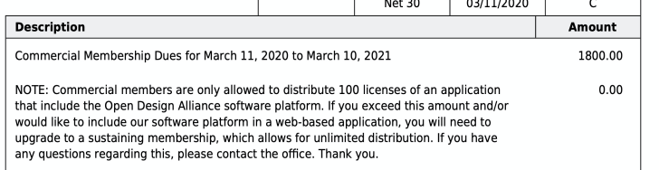

# 通用模块
- 搭建LeadApi模块，集中统一管理api后台接口。
- 发布LeadPay，目前只对线上（微信、支付宝）、线下模块的支付提交、发票申请等业务皆已完成，各自业务邮件发送、抄送相关人财务、客服人员。
# 具体业务模块
- 上周发布新版exWinner
- 发布新版PC dx2
- 发布新版扒图，集成公司授权的新版ODA组件，目前能打开dwg图纸至2020版，但需要说明点是，咱们公司买的这个版本是非商业版本。

