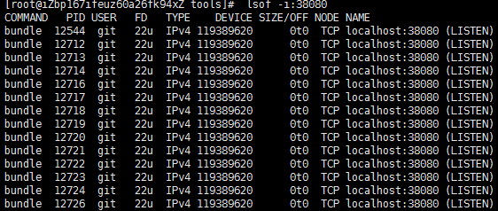

Centos8部署Gitlab

安装步骤

1、rpm -ivh https://mirrors.tuna.tsinghua.edu.cn/gitlab-ce/yum/el8/gitlab-ce-12.10.0-ce.0.el8.x86_64.rpm

https://www.cnblogs.com/hero123/p/10559116.html

[**更改gitlab默认端口**](https://www.cnblogs.com/hero123/p/10559116.html)

若linux服务器的80和8080端口都已经被使用，则需修改gitlab监听的端口

 

修改路径文件：vim /etc/gitlab/gitlab.rb

 

1、修改external_url 'http://ip:端口号'  （将前面的#注释符号去掉）,我改成了10099

 

 

2、找到Advanced settings 下的8080端口 将端口改成自己备用端口号（不能和上面url端口号相同，会冲突占用！），我改的38080

 

3、运行下面命令

- 1.  sudo gitlab-ctl stop --停止服务
  2.  sudo gitlab-ctl reconfigure --启动服务
  3.  sudo gitlab-ctl start --启动所有gitlab组件

启动需要一段时间，上边启动完基本就可以了。

期间可以查看端口进程：

lsof -i:10099

 lsof -i:38080

 

4、若访问不了gitlab，尝试关闭或开放防火墙

如果没有域名，直接输入服务器ip和指定端口进行访问，初始账户: root 密码: 5iveL!fe

git config --global https.proxy http://172.16.2.57:999 git config --global https.proxy https://172.16.2.57:999

allow_local_requests_from_hooks_and_services