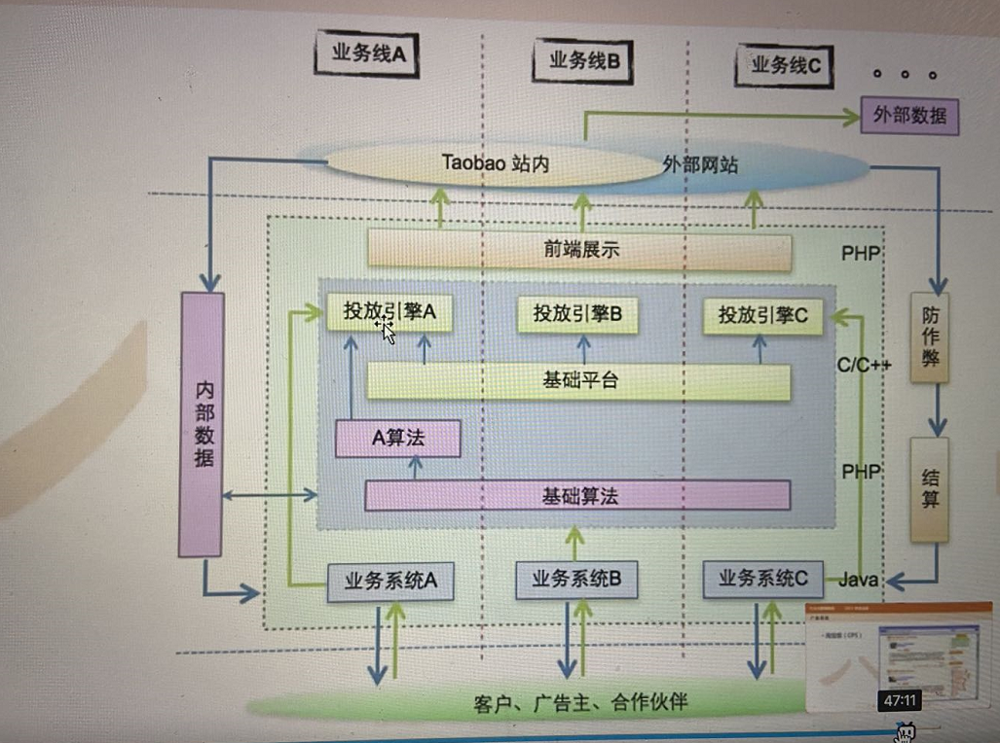
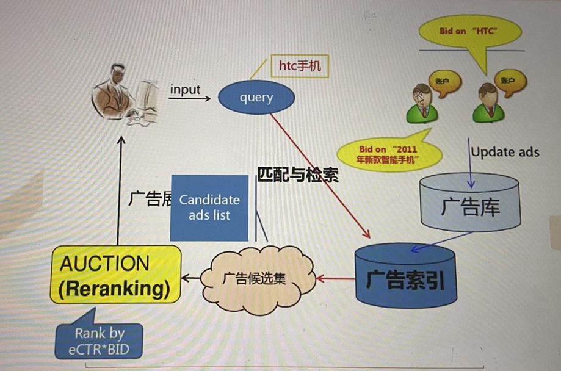
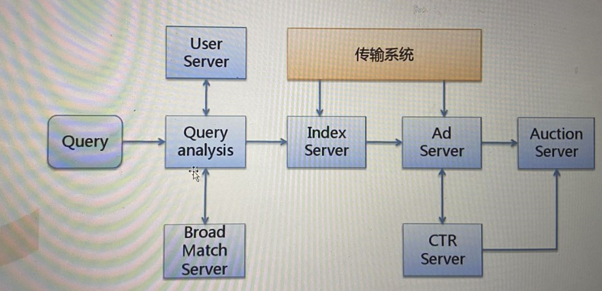

- 清单

|                   | 淘宝     | 百度         | google  |
| ----------------- | -------- | ------------ | ------- |
| 自主搜索流量(P4P) | 直通车   | 搜索推广     | AdWords |
| 联盟外部流量      | 阿里妈妈 | 网盟推广     | AdSense |
| 品牌广告          | 钻石展位 | 百度精准广告 |         |
| 按成交计费        | 淘宝客   |              |         |

- 搜索广告
  
  - 参与的三方：网民、广告主、搜索平台
- 广告触发：keyword Targeting

  - 广告主和网民通过关键词表达需求

  - 网民输入的query和广告主购买的keyword进行匹配
- CTR预估（click/show）：机器学习

  - 点击率用于广告的排序和推左

  - 保护网民的利益和提升搜索引擎的收益
- 广告排序：关键词广告拍卖机制

  - 每一次的广告展现都是一次动态的拍卖

  - 排序函数：ctr*bidy

- Query Analysis
  - 纠错、同义变换、改写
  - 切词、提取主题词
  - 意图分析
- User Server
  - Cookie
  - Session

- Broad Match Sever
  - 实现宽泛匹配
  - 宽泛匹配的相关性很重要
- Index Server
  - 实现精确匹配、短语匹 配
  - 各种业务过滤功能
  - 查找广告倒排索引
- Ad Server
  - 正排表查找广告物料：创意标题、描述、URL

- CTR Server
  - 实现CTR预估功能，输入<query，ad>，输出pctr
  - 计算密集：一次预估数百feature提取和查表
  - 内存密集：模型文件非常大
- Auction Server
  - 广告排序：CTR*bid
  - 广告推左：选择高质量广告展现在左侧