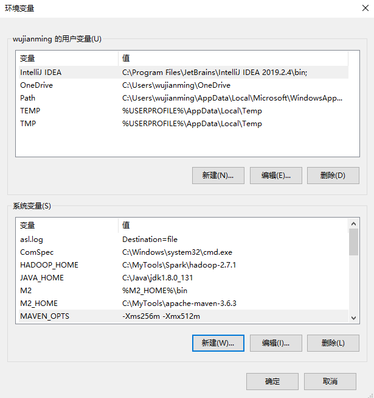

# IDEA maven设置配置

------

## IDEA Maven配置

### 1. 下载maven

[下载地址](http://maven.apache.org/download.cgi)
从官网上，下载一个压缩包，然后解压到任意的文件夹
Maven的安装必须需要jdk1.7+

### 2. 环境变量设置

M2_HOME改为具体的路径，其他的就直接复制就好

```
M2_HOME=C:\MyTools\apache-maven-3.6.3
M2=%M2_HOME%\bin
MAVEN_OPTS=-Xms256m -Xmx512m
```


Path目录下添加以下

```
%M2%
```

[](https://img2018.cnblogs.com/blog/1210268/201906/1210268-20190601102836157-658142429.png)

打开cmd，输入`mvn --version`，出现以下类似以下结果，则配置成功

```
复制Apache Maven 3.6.1 (d66c9c0b3152b2e69ee9bac180bb8fcc8e6af555; 2019-04-05T03:00:29+08:00)
Maven home: Q:\maven\apache-maven-3.6.1\bin\..
Java version: 1.8.0_131, vendor: Oracle Corporation, runtime: C:\Program Files\Java\jdk1.8.0_131\jre
Default locale: zh_CN, platform encoding: GBK
OS name: "windows 10", version: "10.0", arch: "amd64", family: "windows"
```

### 3. 配置镜像和下载jar目录

打开maven目录下的`conf/settings.xml`
找到`mirrors`标签，在其下面复制下面的代码

```
	<mirror>
      <id>alimaven</id>
      <name>aliyun maven</name>
      <url>http://maven.aliyun.com/nexus/content/groups/public/</url>
      <mirrorOf>central</mirrorOf>
    </mirror>
	
	<mirror>
      <id>repo2</id>
      <mirrorOf>central</mirrorOf>
      <name>Human Readable Name for this Mirror.</name>
      <url>http://repo2.maven.org/maven2/</url>
    </mirror>

    <mirror>
      <id>ui</id>
      <mirrorOf>central</mirrorOf>
      <name>Human Readable Name for this Mirror.</name>
      <url>http://uk.maven.org/maven2/</url>
    </mirror>
```

找到`localRepository`标签，在里面填写jar包下载的目录，不写的话默认就会下载到c盘

```
<localRepository>Q:\maven\maven_jar</localRepository>
```

[](https://img2018.cnblogs.com/blog/1210268/201906/1210268-20190601103320602-1737075109.png)

### 4. IDEA设置Maven

#### 修改默认设置，只对于新建的项目，设置才会有效

[](https://img2018.cnblogs.com/blog/1210268/201906/1210268-20190601103907526-994899629.png)

[](https://img2018.cnblogs.com/blog/1210268/201906/1210268-20190601103837601-459375367.png)

#### 为当前项目添加Maven

[](https://img2018.cnblogs.com/blog/1210268/201906/1210268-20190601104137430-1280633284.png)

[](https://img2018.cnblogs.com/blog/1210268/201906/1210268-20190601104050520-305282677.png)
在出现的选项中选择maven

选择右边的maven选项，点击install，idea就会自动下载一些jar
[](https://img2018.cnblogs.com/blog/1210268/201906/1210268-20190601104305572-630785251.png)

之后再点击左上角的刷新，直到没有红线，就说明配置成功了
[](https://img2018.cnblogs.com/blog/1210268/201906/1210268-20190601104419610-356030623.png)

------

提问之前，请先看[提问须知](https://www.cnblogs.com/stars-one/p/12500031.html) 点击右侧图标发起提问